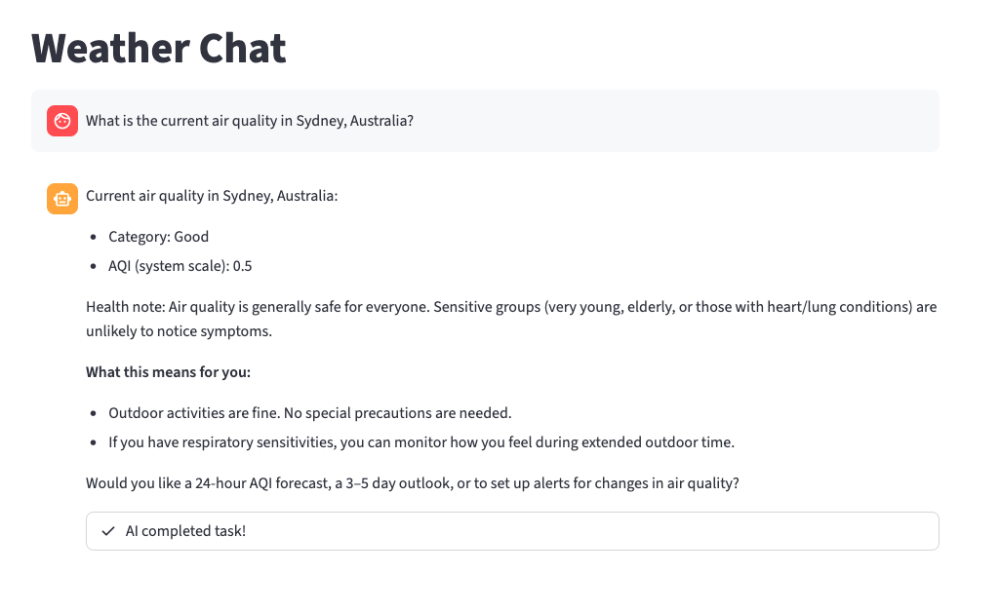

# Summer Chatbot with Strands Agents

Ask the chatbot any question about a city's weather or air quality! About any city in the world 🌏. See example below:



**Goal:**

To create a production-ready chatbot that gives information about inclement summer weather and climate/atmospheric conditions, and gives tips on how to exercise caution when you are outside during the day.

You can consider this a production-grade update to the previous [Summer Chatbot](https://github.com/sunmkim/summer-days) project using Strands. The previous version was built with LangGraph, and was more akin to a proof-of-concept.

## Technologies Used

- [Strands Agents](https://strandsagents.com/latest/) (an open source agents SDK from AWS)
- [Amazon Bedrock AgentCore](https://aws.amazon.com/bedrock/agentcore/)
- [LiteLLM](https://www.litellm.ai/)
- [OpenWeather API](https://openweathermap.org/api)

## How to run

**Locally**
To run your agent locally, run `uv run weather_agent/agent.py`. With this running in the background, open another terminal window. In the new window, run the following:
```
curl -X POST http://localhost:8080/invocations \
  -H "Content-Type: application/json" \
  -d '{"prompt": "What is the weather in Sydney, Australia"}'
```

You should see a response that looks like:
```
{"role": "assistant", "content": [{"text": "Here’s the current weather in Sydney, Australia:\n\n- Temperature: 21.8°C (about 71°F)\n- Humidity: 43%\n- UV index: 6.2 (high risk)\n- Alerts: none\n\nQuick take:\n- It’s a warm, sunny day. The high UV means you’ll need sun protection if you’re outdoors.\n\nSafety tips:\n- Use broad-spectrum sunscreen SPF 30+ and reapply every 2 hours (more often if swimming or sweating).\n- Wear a hat, sunglasses, and light, long clothing to cover exposed skin.\n- Seek shade during peak sun hours (roughly 10 a.m. to 4 p.m.) and stay hydrated.\n\nWould you like an air quality index for Sydney or a short forecast for the rest of the day?"}]}
```

**Locally with Streamlit**
Run `uv run weather_agent/agent.py`. Then run the following command in the root folder of this project: 
```
uv run streamlit run app.py
```

The Streamlit UI in `app.py` is a modified version of an AWS example from [here](https://github.com/awslabs/amazon-bedrock-agentcore-samples/blob/main/03-integrations/ux-examples/streamlit-chat/app.py). (Unfortunately, UI is not my strong suit)

We need to create agent memory before running the script. (Use terraform)